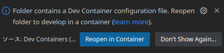
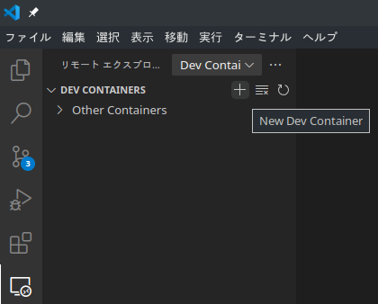
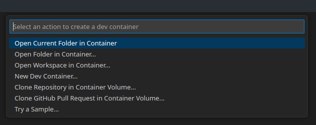
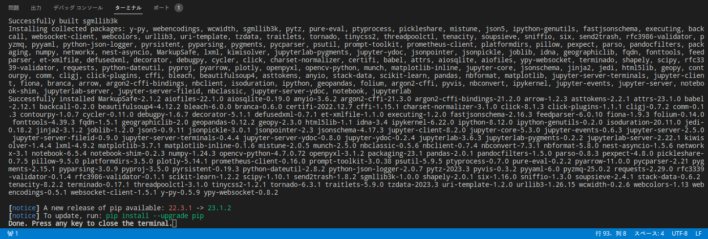
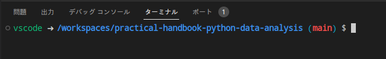

# Pythonデータ分析 実践ハンドブック サンプルコード

[](https://book.impress.co.jp/books/1122101021)

## 書籍

Pythonデータ分析 実践ハンドブック  
実務で使えるデータ加工のテクニック

- https://book.impress.co.jp/books/1122101021

## サンプルコードのリンク

- [第2章 データの種類と読み込み](./02-read-data)
- [第3章 表形式データの加工](./03-table-data)
- [第4章 NumPyと数値データ](./04-numerical)
- [第5章 データの評価](./05-evaluation)
- [第6章 時系列データの処理](./06-timeseries)
- [第7章 テキスト情報の処理](./07-text-data)
- [第8章 画像データの処理](./08-image-data)
- [第9章 グラフデータの処理](./09-graph-network)
- [第10章 地理空間データの処理](./10-geo-data)
- [第11章 データ加工のための線形代数](./appendix)
- [付録C pandasとMatplotlib による可視化](./11-math)

## 環境設定方法

### venvを利用した環境設定

リポジトリをcloneします。

```bash
git clone https://github.com/practical-handbook-python-data-analysis/practical-handbook-python-data-analysis.git
cd practical-handbook-python-data-analysis
```

#### Linux/macOSの仮想環境

仮想環境を作成します。

```
python -m venv venv
```

仮想環境を有効化します。

```bash
source venv/bin/activate
```

#### Windowsの仮想環境

WindowsのコマンドはPowerShellを前提としています。

スクリプトに実行権限を与える必要があります。 これはPC環境で一度だけ実行します。

```
Set-ExecutionPolicy RemoteSigned -Scope CurrentUser
```

仮想環境を作成します。

```
py -m venv venv
```

仮想環境を有効化します。

```
venv\Scripts\Activate.ps1
```

#### Pythonパッケージのインストール

pipをアップグレードし、パッケージをインストールします。

```bash
python -m pip install pip -U
pip install -r requirements.txt -c constraints.txt
```

### dev-containerを利用した環境設定

VS Codeをインストールします。

https://code.visualstudio.com/

Dev Containers extensionをインストールします。

https://marketplace.visualstudio.com/items?itemName=ms-vscode-remote.remote-containers

Dockerをインストールし、起動します。

- [Windows / macOS](https://www.docker.com/products/docker-desktop)
- [Linux](https://docs.docker.com/install/#supported-platforms)

Linuxの場合はユーザーを docker グループに追加します。 サインアウトして再度ログインすると、この設定が有効になります。

```bash
sudo usermod -aG docker $USER
```

VS Codeを起動します。

```bash
cd practical-handbook-python-data-analysis
code .
```

次のようなポップアップが表示されたら、「Reopen in Container」をクリックします。



ポップアップが表示されたなかった場合は「リモートエクスプローラー」 -> 「DEV CONTAINERS」 にある　「New Dev Container」ボタン（＋ボタン）をクリックします。



「Open Current Folder in Container」を選択します。



ターミナルに `Done. Press any key to close terminal` が表示されたら、任意のキーを入力します。



次の画面が表示されたら、環境設定は完了です。

